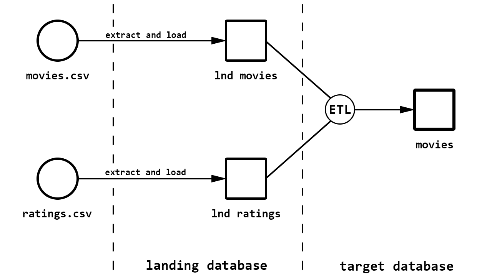

# Server
---
The utility execute SQL queries for setup landing and target databases. It executes the following ETL processes with the following databases:



## Installation
---
Your system must have [required frameworks](https://bitbucket.org/coherentprojects/coherent-training-dmitry-skrobat/src/master/top-movies-sql/server/requirements.txt). To install them use:
```bash
pip install -r requirements.txt
```

## Config
---
This utility supports [config](https://bitbucket.org/coherentprojects/coherent-training-dmitry-skrobat/src/master/top-movies-sql/server/config/) files. Config has the following structure:

```text
config
├── config.yaml
│   ├── database_config
│   │   ├── landing
│   │   └── target
│   └── dataset
└── databases
    ├── landing_config.yaml
    │   ├── database
    │   │   ├── user
    │   │   ├── password
    │   │   ├── host
    │   │   ├── port
    │   │   └── db
    │   └── sql
    │       ├── databases
    │       ├── tables
    │       └── population_scripts
    └── target_config.yaml
        ├── database
        │   ├── user
        │   ├── password
        │   ├── host
        │   ├── port
        │   └── db
        └── sql
            ├── databases
            ├── tables
            ├── functions
            ├── procedures
            └── population_scripts
```

## Usage
---
```text
usage: setup.sh [-h] [-l]
```

### Parameters
- `-h, --help` - show help message and exit.
- `-l, --load` - determines the need to download the dataset.

#### Help message
Use `-h` or `--help` to get the help message. For example:
```bash
bash setup.sh -h
```

The utility produces the following output:
```text
usage: setup.sh [-h] [-l]

The script is used to set up the database

optional arguments:
    -h, --help   show this help message and exit
    -l, --load   determine whether it is necessary to download the dataset
```

#### Load
Specify `-l` or `--load` argument so that before databases setup, download the dataset specified in the [config](https://bitbucket.org/coherentprojects/coherent-training-dmitry-skrobat/src/master/top-movies-sql/server/config/config.yaml) from the [grouplens](https://grouplens.org/datasets/movielens/) website.  For example:
```bash
bash setup.sh -l
```

The utility produces the following output:
```text
Dataset ml-latest-small: downloaded successfully
Databases: setup successfully
```

## Databases
---
The server works with two databases, with landing and target databases.

### Landing database
The landing database has two tables namely [movies](https://bitbucket.org/coherentprojects/coherent-training-dmitry-skrobat/src/master/top-movies-sql/server/sql/ddl/tables/landing_database/create_movies_table.sql) and [ratings](https://bitbucket.org/coherentprojects/coherent-training-dmitry-skrobat/src/master/top-movies-sql/server/sql/ddl/tables/landing_database/create_ratings_table.sql). Stores exactly the same information as CSV files.

#### Movies table
Landing movies table has the following fields:
```text
+----------+--------------+------+-----+---------+----------------+
| Field    | Type         | Null | Key | Default | Extra          |
+----------+--------------+------+-----+---------+----------------+
| id       | int unsigned | NO   | PRI | NULL    | auto_increment |
| movie_id | varchar(255) | YES  |     | NULL    |                |
| title    | varchar(255) | YES  |     | NULL    |                |
| genres   | varchar(255) | YES  |     | NULL    |                |
+----------+--------------+------+-----+---------+----------------+
```

An example of the first ten rows of the landing movies table:
```text
+----+----------+------------------------------------+---------------------------------------------+
| id | movie_id | title                              | genres                                      |
+----+----------+------------------------------------+---------------------------------------------+
|  1 | 1        | Toy Story (1995)                   | Adventure|Animation|Children|Comedy|Fantasy |
|  2 | 2        | Jumanji (1995)                     | Adventure|Children|Fantasy                  |
|  3 | 3        | Grumpier Old Men (1995)            | Comedy|Romance                              |
|  4 | 4        | Waiting to Exhale (1995)           | Comedy|Drama|Romance                        |
|  5 | 5        | Father of the Bride Part II (1995) | Comedy                                      |
|  6 | 6        | Heat (1995)                        | Action|Crime|Thriller                       |
|  7 | 7        | Sabrina (1995)                     | Comedy|Romance                              |
|  8 | 8        | Tom and Huck (1995)                | Adventure|Children                          |
|  9 | 9        | Sudden Death (1995)                | Action                                      |
| 10 | 10       | GoldenEye (1995)                   | Action|Adventure|Thriller                   |
+----+----------+------------------------------------+---------------------------------------------+
```

#### Ratings table
Landing ratings table has the following fields:
```text
+-----------+--------------+------+-----+---------+----------------+
| Field     | Type         | Null | Key | Default | Extra          |
+-----------+--------------+------+-----+---------+----------------+
| id        | int unsigned | NO   | PRI | NULL    | auto_increment |
| user_id   | varchar(255) | YES  |     | NULL    |                |
| movie_id  | varchar(255) | YES  |     | NULL    |                |
| rating    | varchar(255) | YES  |     | NULL    |                |
| timestamp | varchar(255) | YES  |     | NULL    |                |
+-----------+--------------+------+-----+---------+----------------+
```

An example of the first ten rows of the landing ratings table:
```text
+----+---------+----------+--------+-----------+
| id | user_id | movie_id | rating | timestamp |
+----+---------+----------+--------+-----------+
|  1 | 1       | 1        | 4.0    | 964982703 |
|  2 | 1       | 3        | 4.0    | 964981247 |
|  3 | 1       | 6        | 4.0    | 964982224 |
|  4 | 1       | 47       | 5.0    | 964983815 |
|  5 | 1       | 50       | 5.0    | 964982931 |
|  6 | 1       | 70       | 3.0    | 964982400 |
|  7 | 1       | 101      | 5.0    | 964980868 |
|  8 | 1       | 110      | 4.0    | 964982176 |
|  9 | 1       | 151      | 5.0    | 964984041 |
| 10 | 1       | 157      | 5.0    | 964984100 |
+----+---------+----------+--------+-----------+
```

### Target database
The target database only has a [movies](https://bitbucket.org/coherentprojects/coherent-training-dmitry-skrobat/src/master/top-movies-sql/server/sql/ddl/tables/target_database/create_movies_table.sql) table. Stores already processed data without bad data.

#### Movies table
Target movies table has the following fields:
```text
+----------+---------------------+------+-----+---------+----------------+
| Field    | Type                | Null | Key | Default | Extra          |
+----------+---------------------+------+-----+---------+----------------+
| id       | int unsigned        | NO   | PRI | NULL    | auto_increment |
| movie_id | int unsigned        | NO   |     | NULL    |                |
| title    | varchar(255)        | NO   |     | NULL    |                |
| year     | smallint unsigned   | NO   |     | NULL    |                |
| genre    | varchar(255)        | NO   |     | NULL    |                |
| rating   | float(5,4) unsigned | NO   |     | NULL    |                |
+----------+---------------------+------+-----+---------+----------------+
```

An example of the first ten rows of the target movies table:
```text
+----+----------+------------------+------+-----------+--------+
| id | movie_id | title            | year | genre     | rating |
+----+----------+------------------+------+-----------+--------+
|  1 |        1 | Toy Story        | 1995 | Fantasy   | 3.9209 |
|  2 |        1 | Toy Story        | 1995 | Comedy    | 3.9209 |
|  3 |        1 | Toy Story        | 1995 | Children  | 3.9209 |
|  4 |        1 | Toy Story        | 1995 | Animation | 3.9209 |
|  5 |        1 | Toy Story        | 1995 | Adventure | 3.9209 |
|  6 |        2 | Jumanji          | 1995 | Adventure | 3.4318 |
|  7 |        2 | Jumanji          | 1995 | Fantasy   | 3.4318 |
|  8 |        2 | Jumanji          | 1995 | Children  | 3.4318 |
|  9 |        3 | Grumpier Old Men | 1995 | Comedy    | 3.2596 |
| 10 |        3 | Grumpier Old Men | 1995 | Romance   | 3.2596 |
+----+----------+------------------+------+-----------+--------+
```